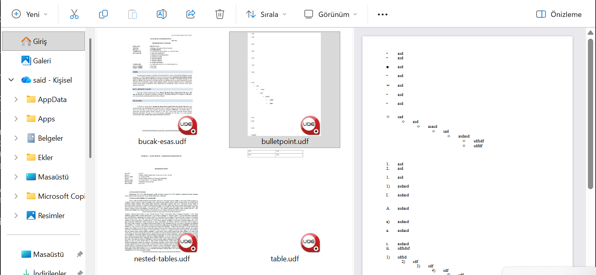

# UDF Görüntüleyici + Küçük Resim & Önizleme (Windows)

UYAP `.udf` dosyaları için Windows uygulaması — macOS [Hızlı Bakış (QuickLook) eklentisinin](https://github.com/saidsurucu/udf-quicklook-extension) Windows karşılığı:

- Dosya Gezgini'nde dosya simgesinde **küçük resim (thumbnail)** — belgenin ilk sayfası.
- Dosya Gezgini **Önizleme Bölmesi** (Alt+P) ile **önizleme** (kaydırma, metin seçip kopyalama).
- Çift tıklayınca **bağımsız görüntüleyici**.
- Görüntüleyicide **"UYAP Editör'de Aç"** düğmesi (UYAP Doküman Editörü kuruluysa).

## Ekran görüntüsü

Solda Gezgin küçük resimleri, sağda Önizleme Bölmesi:



## Kurulum

PowerShell'e yapıştırın:

```powershell
irm https://github.com/saidsurucu/udf-preview-win/releases/latest/download/install.ps1 | iex
```

Derleme veya araç zinciri gerekmez — hazır, kendi kendine yeten DLL indirilir.
**Küçük resim** yönetici istemez; **Önizleme Bölmesi** için bir kez yönetici (UAC) onayı
gerekir. Gereksinim: Windows 10/11 (x64) + Edge WebView2 Runtime (Windows 11'de yerleşik,
Windows 10'da otomatik kurulur).

## Kaldırma

```powershell
irm https://github.com/saidsurucu/udf-preview-win/releases/latest/download/uninstall.ps1 | iex
```

## Görünmüyorsa

- Küçük resim için **Görünüm → Büyük simgeler** (veya Çok büyük simgeler).
- Önizleme için **Alt+P** ile Önizleme Bölmesi'ni açın.
- OneDrive'da henüz indirilmemiş (bulut) `.udf` dosyaları küçük resim göstermeyebilir;
  dosyayı yerele indirince çalışır.

## Geliştirici notları

Saf Rust (stable) ile derlenir. Dört crate:

- **`udf-core`** — ZIP/XML ayrıştırma, rune (Unicode skaler) ofset dilimleme, ARGB renk
  (`borderColor=0` opak), ve iki saf backend: HTML (WebView2 ile) + lean RTF (RichEdit
  küçük resmi için). Birim + entegrasyon testli, cross-platform.
- **`udf-cli`** — `.udf` → HTML/RTF (`udf-cli x.udf -o out.html`).
- **`udf-viewer`** — WebView2 görüntüleyici + "UYAP Editör'de Aç".
- **`udf-shell`** — in-process COM DLL: `IThumbnailProvider` + `IPreviewHandler`.

Kaynaktan kurmak için:

```powershell
cargo build -p udf-shell --release
crates\udf-shell\register.ps1      # Önizleme Bölmesi için yönetici olarak çalıştırın
```

Yeni sürüm yayınlamak: `git tag vX.Y.Z && git push origin vX.Y.Z` — GitHub Actions
Windows'ta derleyip self-contained DLL + kurulum scriptlerini Release'e ekler.

## Lisans

MIT
